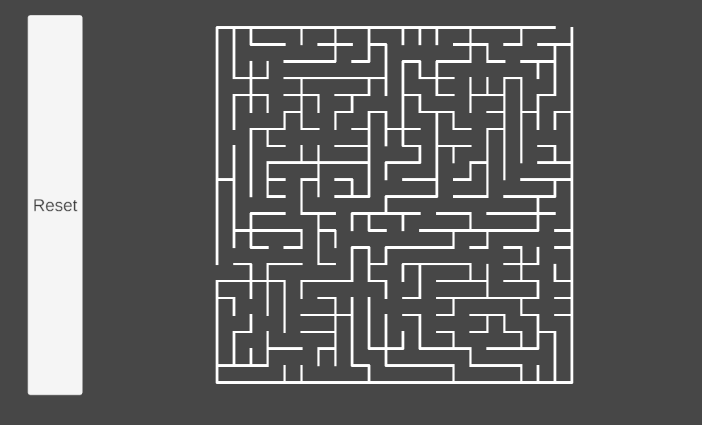

# MazeGenerator

## Overview

This Unity project demonstrates the implementation of **Prim's algorithm** for generating a maze. The maze is a **fixed size**, and the algorithm ensures that each cell is accessible with only one valid path from the start to the finish. 

Although this project is currently built in Unity, the underlying logic has been designed to run as a **standalone application**, making it flexible for adaptation in non-Unity environments. A simple script would be required to handle the visuals if used outside of Unity.

  
*(Insert a screenshot showing a generated maze in Unity)*

### How Prim's Algorithm Works

Prim's algorithm is a minimum spanning tree algorithm that efficiently generates a **perfect maze** where each cell has only one valid path to another. Here's how it works in the context of this project:

1. **Initialization**:  
   The algorithm starts at a random cell and marks it as part of the maze. The maze is initialised to be filled with walls

2. **Growing the Maze**:  
   A list of walls is maintained, and at each step, a random wall is selected. If only one of the cells divided by this wall has been visited, the wall is removed to create a passage, and the unvisited cell is added to the maze.

3. **Completion**:  
   This process is repeated until the list of walls is empty, ensuring only one path exists between any two cells.

  
*Purpy Pupple, CC BY-SA 3.0 <https://creativecommons.org/licenses/by-sa/3.0>, via Wikimedia Commons*

### Project Structure

- **C# Implementation**: The core logic for Prim's algorithm is written in C#, making it easy to adapt for other environments.
- **Unity Framework**: The project uses Unity for handling visualization and interaction but can be decoupled for standalone use.
- **Fixed Size Maze**: The maze generated is of a fixed size, but the size can be modified by tweaking parameters in the code.

### Features

- **Single Path from Start to Finish**: Every maze generated ensures there is only one path between any two points, making it a perfect maze.
- **Fully Accessible Cells**: Each cell in the maze is accessible, with no isolated areas.
- **Standalone Compatibility**: The project has been designed to be run independently of Unity, with only minor modifications required for visual handling.
  
### Customization

1. **Maze Size**:  
   The size of the maze can be adjusted by changing the parameters in the script.
   
2. **Maze Visuals**:  
   Although Unity is used for visualization, it's easy to create a custom renderer outside of Unity by writing a script to handle the visuals.


### Getting Started


#### Installation

1. Clone the repository (or downlaod build):
    ```bash
    git clone https://github.com/Umar-Kamran/MazeGenerator.git
    ```

2. Open Maze.exe

3. Escape key to exit

### Running Outside of Unity

To run this project as a standalone application:
1. Extract the core C# script for Prim's algorithm.
2. Write a custom rendering script to handle the visualization of the maze.


### Future Improvements

- [ ] Add support for different maze generation algorithms (e.g., Kruskal’s algorithm).
- [ ] Implement a user interface for generating mazes of varying sizes.
- [ ] Develop an AI that can solve the maze in real-time.

---

### License

This project is licensed under the MIT License - see the [LICENSE.txt](LICENSE.txt) file for details.

